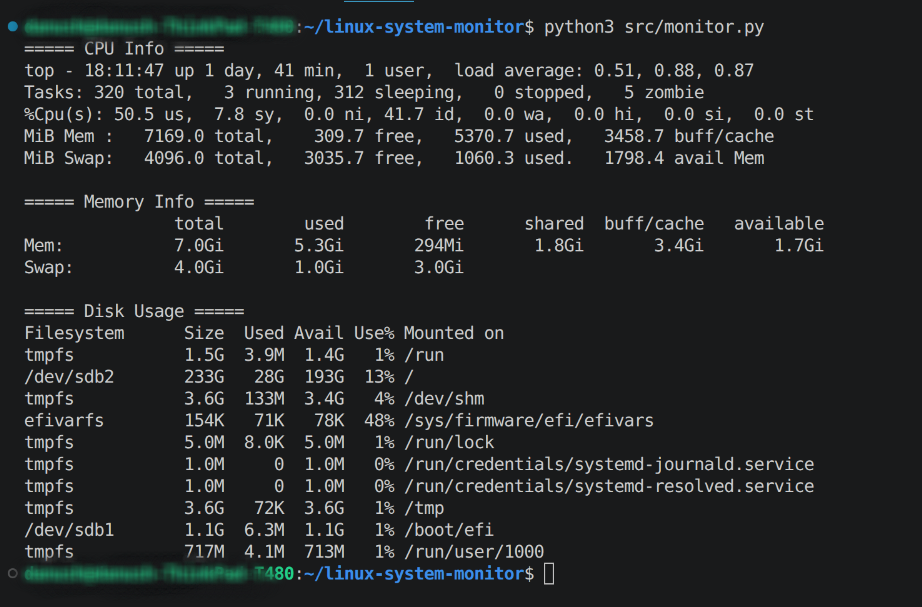

# Linux System Monitor

A lightweight Linux system monitoring tool built using Python.
It displays CPU, memory, disk usage, and current user information directly in the terminal.

---

# Overall

This project demonstrates how Python can interact with Linux system utilities to retrieve and display system-level information in a simple CLI tool.

---

# Features

CPU usage summary

Memory usage statistics

Disk usage information

Current logged-in user

---

# Used

- Python 3
- Linux commands: "top", "free", "df", "whoami"

---

# Project Structure
```text
linux-system-monitor/
├── src/
│   └── monitor.py
├── assets/
│   └── demo.png
├── docs/
├── tests/
├── README.md
└── .gitignore
```

---

# Getting Started

Prerequisites

- Linux system
- Python 3 installed

# Run the Project

git clone https://github.com/danushteja20-boop/linux-system-monitor.git

cd linux-system-monitor

python3 src/monitor.py

---

# Demo


---

# Code Explanation

"top -b -n1 | head -5" → CPU and system summary

"free -h" → Memory usage

"df -h" → Disk usage

"whoami" → Current user

---

# Limitations

Uses system commands (not native Python metrics)

Not real-time monitoring

Output is not structured

---

# Future Improvements

Real-time monitoring

Use Python libraries like "psutil"

Add process-level tracking

CLI arguments support

Web dashboard

---

# License

This project is open-source and available under the MIT License.
